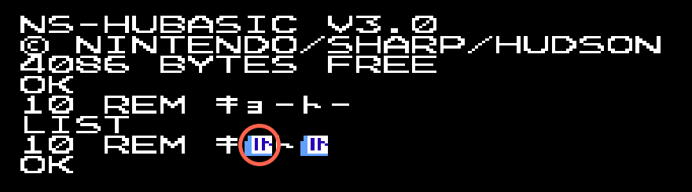
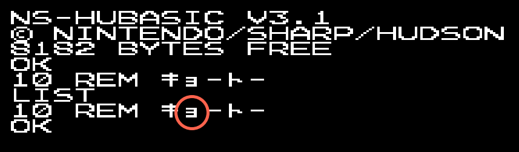
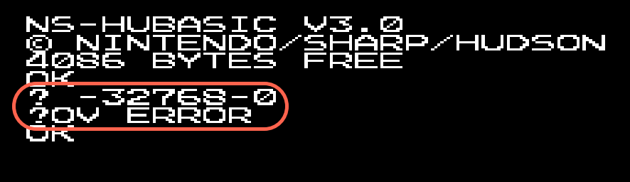
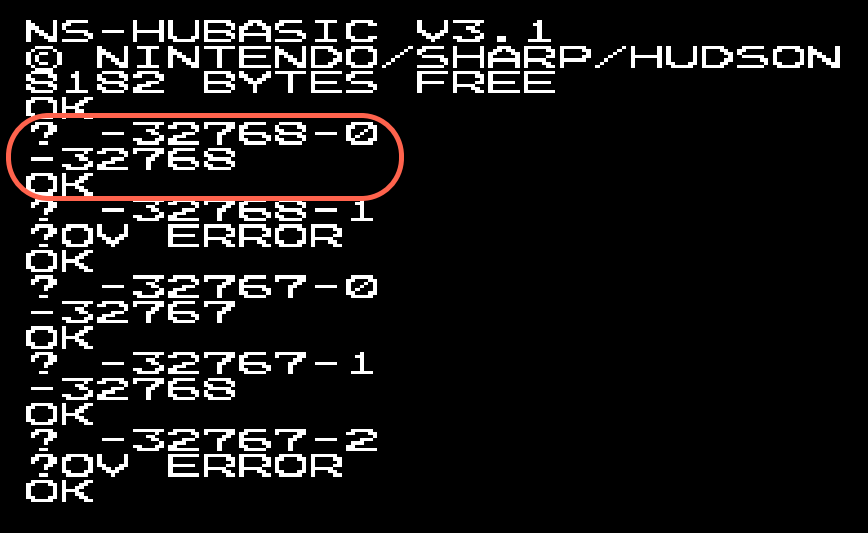

# Nintendo Famicom Family BASIC

## Version 0 & 1
These are the original versions for the Famicom.<br>

I don't know much about this but I know [Mr Lurch has done a video](https://youtu.be/f1hPLmRiDNo) with v1.<br>

## Version 2.0A
- PRG: two 16KB (128Kbit) ROMs (RP2D129 0531 and RP2D129 0532) labelled "HVC-FBI-1A" and "HVC-FBI-1B"
- CHR: one 8KB (64Kbit) ROM (RP2D68 0047) labelled "HVC-FB1-0C"
- RAM: 2KB (Fujitsu MB8416A-15-SK)<br>

## Version 2.1A
This is a bugfix version that was available if you returned your v2.0A cartridge.<br>
- PRG: one 32KB (256Kbit) ROM (Fujitsu MB83256) labelled "HVC-FB1-2W"
- CHR: one 8KB (64Kbit) ROM (RP2D70 0032) labelled "HVC-FB1-0C"
- RAM: 2KB (Fujitsu MB8416A-16L-SK)

## Version 3.0
Improved BASIC with double the RAM of v2.<br>
- PRG: one 32KB (256Kbit) ROM (Toshiba TC53257P-1613) labelled "HVC-VT-0W"
- CHR: one 8KB (64Kbit) ROM (M3864-31) labelled "HVC-FB1-0C"
- RAM: 4KB (Toshiba TC5533P-B)

## Adding Support for 8KB RAM
The top of memory is hardcoded to 4KB (in v3.0) so simply replacing the 4KB (32Kbit) RAM won't make any difference - the code needs patching.<br>

There is a [information available](https://github.com/NipponNoraneko/FC-DiskBASIC) about patching v2.1A to mainly add Famicom Disk System (FDS) support, which also increases the RAM to 8KB.  This information mainly concerns itself with creating a Disk BASIC whereas I'm more interested in purely upgrading the cartridge.<br>

This [disassembly of the v3.0 ROM](https://github.com/micahcowan/fbdasm) is invaluable.<br>

So far it looks like these are the required patches in the v3.0 ROM to increase the top of RAM from 0x6FFF (4KB) to 0x7FFF (8KB) - working on verifying the others:<br>
```
   bgGetRam  .eq $6c00  {addr/1024} ; region to save bg data with BGGET
   memoryTop .eq $6fff              ; What FRETOP is set to by default

PATCH0: lda #>memoryTop
06A4: 6F -> 7F

PATCH1: cmp #$70 ;arg >= #$7000?
17D8: 70 -> 80

PATCH2: lda #(>memoryTop)+1
2DC9: 70 -> 80

PATCH3: cmp #>bgGetRam ;is there room after program for BG data?
31BE: 6C -> 7C     

PATCH4: lda #>bgGetRam
31CB: 6C -> 7C

PATCH5: lda #>bgGetRam
320C: 6C -> 7C
```

I am working on a Python script to make this patching of the binary ROM simple:<br>
```
% python3 fb_rom_patcher.py Family_BASIC_v30_PRG_CHR.NES

#############################################
# Brett's Nintendo Family BASIC ROM patcher #
# for 8KB RAM Support (Jan 2026)            #
#############################################

>> Input ROM checksum: 0x6BA08175
>> Detected: Family BASIC v3.0 (PRG+CHR+NES 2.0 header)

>> Applying single-byte patches:
Patching 0x000A: 0x60 → 0x70 [NES 2.0 header 4KB->8KB]
Patching 0x06B4: 0x6F → 0x7F [Increase RAM limit from 0x6C00 to 0x7C00]
Patching 0x17E8: 0x70 → 0x80 [Increase RAM limit from 0x6C00 to 0x7C00]
Patching 0x2DD9: 0x70 → 0x80 [Increase RAM limit from 0x6C00 to 0x7C00]
Patching 0x31CE: 0x6C → 0x7C [Increase RAM limit from 0x6C00 to 0x7C00]
Patching 0x31DB: 0x6C → 0x7C [Increase RAM limit from 0x6C00 to 0x7C00]
Patching 0x321C: 0x6C → 0x7C [Increase RAM limit from 0x6C00 to 0x7C00]
Patching 0x133E: 0xA0 → 0xA9 [REM statement bug fix]
Patching 0x4F99: 0x30 → 0x31 [Version change to v3.1]

>> Applying multi-byte patches:
Patching 0x0CAD: 0xA5 → 0xA5 [RENUM command bug fix]
Patching 0x0CAE: 0x7D → 0x7C [RENUM command bug fix]
Patching 0x0CAF: 0xC5 → 0x38 [RENUM command bug fix]
Patching 0x0CB0: 0x7F → 0xE5 [RENUM command bug fix]
Patching 0x0CB1: 0xF0 → 0x7E [RENUM command bug fix]
Patching 0x0CB2: 0x02 → 0xA5 [RENUM command bug fix]
Patching 0x0CB3: 0xB0 → 0x7D [RENUM command bug fix]
Patching 0x0CB4: 0x0C → 0xE5 [RENUM command bug fix]
Patching 0x0CB5: 0xA5 → 0x7F [RENUM command bug fix]
Patching 0x0CB6: 0x7C → 0xB0 [RENUM command bug fix]
Patching 0x0CB7: 0xC5 → 0x09 [RENUM command bug fix]
Patching 0x0CB8: 0x7E → 0x4C [RENUM command bug fix]
Patching 0x0CB9: 0xB0 → 0xAB [RENUM command bug fix]
Patching 0x0CBA: 0x06 → 0x8C [RENUM command bug fix]
Patching 0x0E52: 0x10 → 0x30 [-32768-0 overflow error bug fix]
Patching 0x0E53: 0x06 → 0x04 [-32768-0 overflow error bug fix]

>> Patched ROM saved as: Family_BASIC_v30_PRG_CHR_patched.NES
>> Patched ROM checksum: 0xEFDACFF8
>> SUCCESS: Checksum verified
```

## NES 2.0 Headers
Required to be prepended to the combined PRG+CHR ROM image to run in an emulator.<br>
I've added what *I think* are the correct NES 2.0 headers to my ROMs, and the CRC32 checksum calculation my script checks assumes these.<br>
```
% python3 nes_header_read.py Family_BASIC_v30_PRG_CHR.NES 

#################################
# Brett's NES Header Reader     #
# Work in progress, 14/JAN/2026 #
#################################

Format ............................ NES 2.0
Vs. System PPU variant ............ 0
Vs. System hardware/protection .... 0
PRG-ROM size ...................... 32768 bytes
CHR-ROM size ...................... 8192 bytes
PRG-RAM (volatile) size ........... 0 bytes
PRG-NVRAM (battery-backed) size ... 4096 bytes
CHR-RAM (volatile) size ........... 0 bytes
CHR-NVRAM (battery-backed) size ... 0 bytes
Mapper ............................ 0 (NROM)
Submapper ......................... 0
Mirroring ......................... Vertical
Battery-backed .................... True
Trainer ........................... False
Four-screen VRAM .................. False
VS Unisystem ...................... False
PlayChoice-10 ..................... False
CPU/PPU Timing .................... RP2C02 (NTSC NES)
Default expansion device .......... Family BASIC Keyboard plus Famicom Data Recorder
```

If yours are different and my script rejects your .NES file, just modify the script with the checksum it calculates for your file!<br>
```
KNOWN_CRCS = {
    "FBv10":        (0x868FCD89, 0x00000000), # no 8KB patch planned
    "FBv10_merge":  (0xF7DB8B5C, 0x00000000), # no 8KB patch planned
    "FBv10_NES":    (0x30B1840A, 0x00000000), # no 8KB patch planned
    "FBv20A_merge": (0xF7606810, 0x00000000), # no 8KB patch planned
    "FBv20A_NES2":  (0x300A6746, 0x00000000), # no 8KB patch planned
    "FBv21A":       (0xDE34526E, 0x85BDD21B), # PRG
    "FBv21A_merge": (0x895037BC, 0x72C38E25), # PRG+CHR
    "FBv21A_NES2":  (0x4E3A38EA, 0x3D43C6D0), # PRG+CHR+NES header
    "FBv30":        (0x3AAEED3F, 0xC7FD9017), # PRG
    "FBv30_merge":  (0xB2530AFC, 0x933709F7), # PRG+CHR
    "FBv30_NES2":   (0x6BA08175, 0xEFDACFF8), # PRG+CHR+NES header
    "FB_CHR":       (0x11848B93, 0x00000000)  # CHR
}
```
The checksum for the raw ROM files *should* be correct.<br>

- Family BASIC v2.1 2KB header: 4E 45 53 1A 02 01 03 08 00 00 50 00 00 00 00 23
- Family BASIC v2.1 8KB header: 4E 45 53 1A 02 01 03 08 00 00 70 00 00 00 00 23 (?)
- Family BASIC v3.0 4KB header: 4E 45 53 1A 02 01 03 08 00 00 60 00 00 00 00 23
- Family BASIC v3.0 8KB header: 4E 45 53 1A 02 01 03 08 00 00 70 00 00 00 00 23 (?)

## Version 3.0 Bugfixes
There are [several bugs](https://github.com/micahcowan/fbdasm/blob/main/BUGS.md) in v3 that have been identified.<br>

### [REM Comments Corrupted by Katakana Small Yo (ョ)](https://github.com/micahcowan/fbdasm/blob/main/BUGS.md#rem-comments-corrupted-by-katakana-small-yo-ョ) 
As noted by Micah in his [annotated disassembly](https://famibe.addictivecode.org/disassembly/fb3.nes.html):<br>
Original fault - キョートー　becomes キートー
```
932E: A0 00        TokRemCopyToEnd LDY     #$00                    ;BUG: this should be lda
9330: 85 99                        STA     zpToken                 ;...or else this should be sty
9332: 4C C2 92                     JMP     TokCopyUntilTok
```



Possible fix
```
932E: A9 00        TokRemCopyToEnd LDA     #$00                    ;LDY -> LDA
9330: 85 99                        STA     zpToken
9332: 4C C2 92                     JMP     TokCopyUntilTok
```


### [RENUM Can Create Duplicate Line Numbers](https://github.com/micahcowan/fbdasm/blob/main/BUGS.md#renum-can-create-duplicate-line-numbers)
Original fault
```
                   RENUM_checkNewGeOld
8C9D: A5 7D                        LDA     vZpNewStartLNum+1
8C9F: C5 7F                        CMP     vZpOldStartLNum+1
8CA1: F0 02                        BEQ     @cmpLo              ;is new start lnum (hi byte) > old start lnum (hi byte)?
8CA3: B0 0C                        BCS     RENUM_argsDone      ;yes -> everything's great
8CA5: A5 7C        @cmpLo          LDA     vZpNewStartLNum     ;else, is new start lnum (lo byte) >= old start lnum (lo byte)?
8CA7: C5 7E                        CMP     vZpOldStartLNum     ;BUG! Permits high byte lower, as long as low byte is higher!
8CA9: B0 06                        BCS     RENUM_argsDone      ; This can result in repeated line numbers, and/or lower coming after higher
8CAB: 4C 94 84                     JMP     ErrorIllegalValue
```


Possible fix - treat line numbers as 16-bit numbers:
```
                   RENUM_checkNewGeOld
8C9D: A5 7C                        LDA     vZpNewStartLNum     ; Load new low byte
8C9F: 38                           SEC                         ; Set carry for subtraction
8CA0: E5 7E                        SBC     vZpOldStartLNum     ; Subtract old low byte
8CA2: A5 7D                        LDA     vZpNewStartLNum+1   ; Load new high byte
8CA4: E5 7F                        SBC     vZpOldStartLNum+1   ; Subtract old high byte (with borrow)
8CA6: B0 09                        BCS     RENUM_argsDone      ; If carry set (new >= old), good –> jump to $8CB1
8CA8: 4C AB 8C                     JMP     $8CAB               ; Else error (Illegal quantity at $8CAB)
8CAB: 4C 94 84                     JMP     ErrorIllegalValue
```
(replace $8CA8 with 3xNOP and let it fall through to $8CAB?)


### [Overflow When Subtracting Zero](https://github.com/micahcowan/fbdasm/blob/main/BUGS.md#overflow-when-subtracting-zero)
Incorrect overflow (OV) error is raised when -32768-0 is executed.<br>
```
                   Sub_WAccumIs32768
8E40: A5 2D                        LDA     zpWParam+1
8E42: 10 06                        BPL     @errOverfl     ;BUG: produces OV ERROR even if WParam is zero lol
8E44: 20 FD 8D                     JSR     WParamNegate
8E47: 4C AC 8E                     JMP     Add
8E4A: 4C F2 8E     @errOverfl      JMP     ErrorOverflow
```



Possible fix - raise overflow error only when subtracting positive number (>0)
```
                   Sub_WAccumIs32768
8E40: A5 2D                        LDA     zpWParam+1
8E42: 30 04                        BMI     continue       ;if subtracting negative number, safe -> negate & add
8E44: 20 FD 8D                     JSR     WParamNegate
8E47: 4C AC 8E     continue        JMP     Add
8E4A: 4C F2 8E     @errOverfl      JMP     ErrorOverflow
```

- If subtracting negative number ... correct (negate then add)
- If subtracting zero ... doesn't branch ... falls through to Add
- If subtracting positive number... falls through to ErrorOverflow


