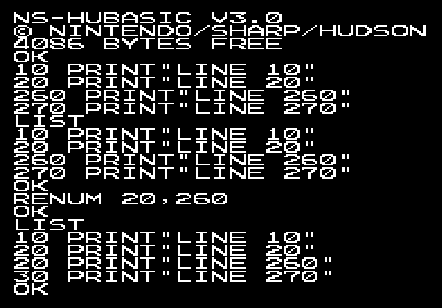
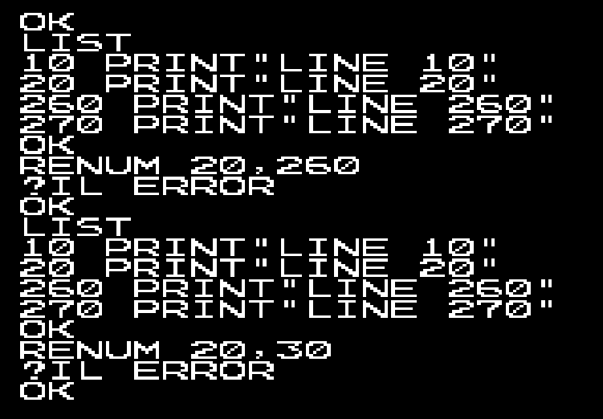

# Nintendo Famicom Family BASIC

## Version 1.0
This is the original version for the Famicom.<br>

I don't know much about this but I know [Mr Lurch has done a video](https://youtu.be/f1hPLmRiDNo) with this version.<br>

## Version 2.0A
- PRG: two 16KB (128Kbit) ROMs (RP2D129 0531 and RP2D129 0532) labelled "HVC-FBI-1A" and "HVC-FBI-1B"
- CHR: one 8KB (64Kbit) ROM (RP2D68 0047) labelled "HVC-FB1-0C"
- RAM: 2KB (Fujitsu MB8416A-15-SK)<br>

## Version 2.1A
This is a bugfix version that was available if you returned your v2.0A cartridge.<br>
- PRG: one 32KB (256Kbit) ROM (Fujitsu MB83256) labelled "HVC-FB1-2W"
- CHR: one 8KB (64Kbit) ROM (RP2D70 0032) labelled "HVC-FB1-0C"
- RAM: 2KB (Fujitsu MB8416A-16L-SK)

## Version 3.0
Improved BASIC with double the RAM of v2.<br>
- PRG: one 32KB (256Kbit) ROM (Toshiba TC53257P-1613) labelled "HVC-VT-0W"
- CHR: one 8KB (64Kbit) ROM (M3864-31) labelled "HVC-FB1-0C"
- RAM: 4KB (Toshiba TC5533P-B)

## Adding Support for 8KB RAM
The top of memory is hardcoded to 4KB (in v3.0) so simply replacing the 4KB (32Kbit) RAM won't make any difference - the code needs patching.<br>

There is a [information available](https://github.com/NipponNoraneko/FC-DiskBASIC) about patching v2.1A to mainly add Famicom Disk System (FDS) support, which also increases the RAM to 8KB.  This information mainly concerns itself with creating a Disk BASIC whereas I'm more interested in purely upgrading the cartridge.<br>

This [disassembly of the v3.0 ROM](https://github.com/micahcowan/fbdasm) is invaluable.<br>

So far it looks like these are the required patches in the v3.0 ROM to increase the top of RAM from 0x6FFF (4KB) to 0x7FFF (8KB) - working on verifying the others:<br>
```
   bgGetRam  .eq $6c00  {addr/1024} ; region to save bg data with BGGET
   memoryTop .eq $6fff              ; What FRETOP is set to by default

PATCH0: lda #>memoryTop
06A4: 6F -> 7F

PATCH1: cmp #$70 ;arg >= #$7000?
17D8: 70 -> 80

PATCH2: lda #(>memoryTop)+1
2DC9: 70 -> 80

PATCH3: cmp #>bgGetRam ;is there room after program for BG data?
31BE: 6C -> 7C     

PATCH4: lda #>bgGetRam
31CB: 6C -> 7C

PATCH5: lda #>bgGetRam
320C: 6C -> 7C
```

I am working on a Python script to make this patching of the binary ROM simple:<br>
```
% python3 fb_8kb_patch.py Family_BASIC_v30_PRG_CHR.NES 

#############################################
# Brett's Nintendo Family BASIC ROM patcher #
# for 8KB RAM Support (Jan 2026)            #
# Work in progress, 12/JAN/2026             #
#############################################

>> Input ROM checksum: 0x55211022
>> Matches Family BASIC v3.0 (iNES header)

>> Applying patches:
Patching 0x06B4: 0x6F → 0x7F (8KB RAM support)
Patching 0x17E8: 0x70 → 0x80 (8KB RAM support)
Patching 0x2DD9: 0x70 → 0x80 (8KB RAM support)
Patching 0x31CE: 0x6C → 0x7C (8KB RAM support)
Patching 0x31DB: 0x6C → 0x7C (8KB RAM support)
Patching 0x321C: 0x6C → 0x7C (8KB RAM support)
Patching 0x133E: 0xA0 → 0xA9 (REM bugfix)
Patching 0x4F99: 0x30 → 0x31 (Version change to v3.1)

>> Patched ROM saved as: Family_BASIC_v30_PRG_CHR_8KB_patch.NES
>> Patched ROM checksum: 0x0BAA6FDA
>> SUCCESS: Checksum verified
```
## NES 2.0 Headers
Required to be prepended to the combined PRG+CHR ROM image to run in an emulator:
- Family BASIC v2.1 2KB header: 4E 45 53 1A 02 01 03 08 00 00 50 00 00 00 00 23
- Family BASIC v2.1 8KB header: 4E 45 53 1A 02 01 03 08 00 00 70 00 00 00 00 23 (?)
- Family BASIC v3.0 4KB header: 4E 45 53 1A 02 01 03 08 00 00 60 00 00 00 00 23
- Family BASIC v3.0 8KB header: 4E 45 53 1A 02 01 03 08 00 00 70 00 00 00 00 23 (?)

## Version 3.0 Bugfixes
There are [several bugs](https://github.com/micahcowan/fbdasm/blob/main/BUGS.md) in v3 that have been identified.<br>

### [REM Comments Corrupted by Katakana Small Yo (ョ)](https://github.com/micahcowan/fbdasm/blob/main/BUGS.md#rem-comments-corrupted-by-katakana-small-yo-ョ) - TESTED FIX
As noted by Micah in his [annotated disassembly](https://famibe.addictivecode.org/disassembly/fb3.nes.html):<br>
Original fault - キョートー　becomes キートー
```
932e: a0 00        TokRemCopyToEnd ldy     #$00                    ;BUG: this should be lda
9330: 85 99                        sta     zpToken                 ;...or else this should be sty
9332: 4c c2 92                     jmp     TokCopyUntilTok
```
Possible fix
```
932e: a5 00        TokRemCopyToEnd lda     #$00
9330: 85 99                        sta     zpToken
9332: 4c c2 92                     jmp     TokCopyUntilTok
```

### [RENUM Can Create Duplicate Line Numbers](https://github.com/micahcowan/fbdasm/blob/main/BUGS.md#renum-can-create-duplicate-line-numbers)
Original fault
```
                   RENUM_checkNewGeOld
8c9d: a5 7d                        lda     vZpNewStartLNum+1
8c9f: c5 7f                        cmp     vZpOldStartLNum+1
8ca1: f0 02                        beq     @cmpLo            ;is new start lnum (hi byte) > old start lnum (hi byte)?
8ca3: b0 0c                        bcs     RENUM_argsDone    ;yes -> everything's great
8ca5: a5 7c        @cmpLo          lda     vZpNewStartLNum   ;else, is new start lnum (lo byte) >= old start lnum (lo byte)?
8ca7: c5 7e                        cmp     vZpOldStartLNum   ;BUG! Permits high byte lower, as long as low byte is higher!
8ca9: b0 06                        bcs     RENUM_argsDone    ; This can result in repeated line numbers, and/or lower coming after higher
8cab: 4c 94 84                     jmp     ErrorIllegalValue
```



Possible fix - treat line numbers as 16-bit numbers:
```
8c9d: a5 7c                        lda vZpNewStartLNum     ; Load new low byte
8c9f: 38                           sec                     ; Set carry for subtraction
8ca0: e5 7e                        sbc vZpOldStartLNum     ; Subtract old low byte
8ca2: a5 7d                        lda vZpNewStartLNum+1   ; Load new high byte
8ca4: e5 7f                        sbc vZpOldStartLNum+1   ; Subtract old high byte (with borrow)
8ca6: b0 09                        bcs RENUM_argsDone      ; If carry set (new >= old), good – jump to $8CB1
8ca8: 4c ab 8c                     jmp $8cab               ; Else error (Illegal quantity at $8CAB)  
```



